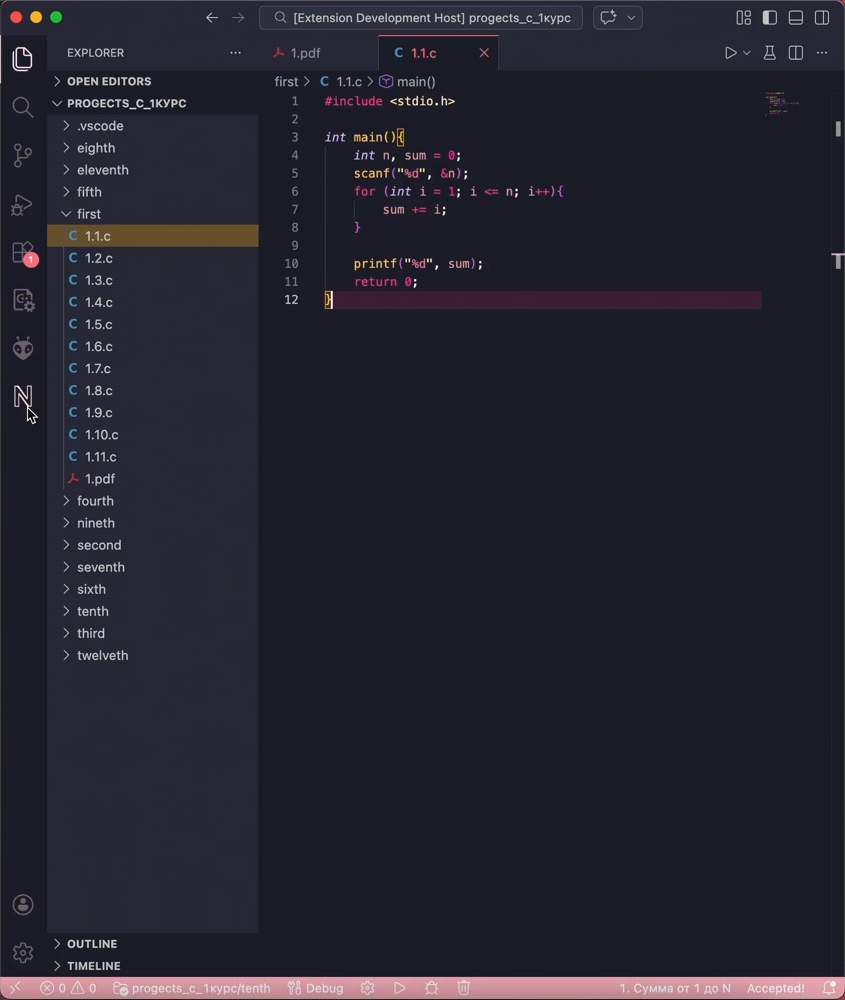

# NSUTS IDE Plugins

## VS Code

### Установка

1. Скачайте расширение [по ссылке](https://github.com/ashemchuk/nsuts-ide-plugins/releases/latest/download/nsuts.vsix)
1. Установите расширение `code --install-extension nsuts.vsix`

### Демонстрация

